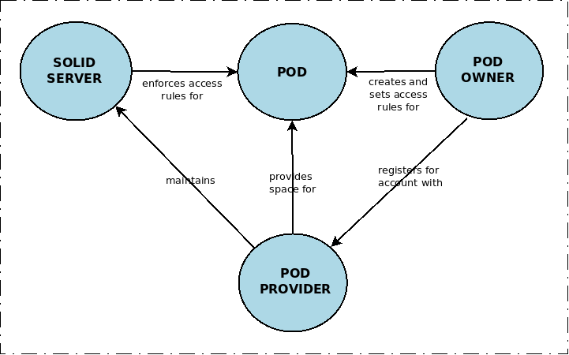

# Solid : Core Concepts and Terms

**See also** [Glossary of Solid Terms](glossary.md) for an alphabetic listing of these terms. 

| Core Concepts | Basic Terms | Advanced Terms |                                  
| -- | -- | -- |                                                                    
| **Reusable Identity** | WebID, IDP, Idenity Provider | OIDC, TLS, CORS, Origin, DPoP, JWT |
| **Control of Data Access** | WAC | ACL, ACP |
| **Decentralized Storage** | Pod, Pod-Provider, Self-hosting, Serverless Pod, CSS, ESS, NSS, | LDP, LDN, Solid-REST |
| **Semantic Linking** | Linked Data, Semantic Web, RDF, Turtle, | JSON-LD, RDFa, N3, N-Triples,  OWL, SPARQL, knowledge graph,  |
| **Persistent Vocabularies** |   ontology, namespace, prefix | foaf:, pim:, schema:
| **Interoperable Apps** | interoperability, specs, | SolidOS, shapes, footprints, SHEX, SHACL |
| **Community Involvement** | github, PR, issue, WiP, DEI, Solid Team, Solid Process,  |

## <a name="storage" class="target">Decentralized Storage</a>

Solid gives you control of your personal data by letting you store it where you choose; by enforcing your ability to manage who accesses it; and by not requireing use of large centralized sevices that have their own data agendas.  At the center of Solid is your Pod.

* A **Pod** is a personal on/offline data storage space that you control. When logged in, you can modify the data and make any part of it private, public, or available to specific audiences.  Personal data includes things like social media postings - in Solid, those belong to you, not to the social media company.

* A **Pod Provider** is a host service that provides you Pod storage space and maintains Solid Server software that enforces the privacy rules you have defined. You are free to switch pod providers at any time. 

* A **Self-Hosted Pod** is a pod that you install and host yourself.  It may either be totlly private or public-facing with access rules you set.

* A **Solid Server** is the software used to provide access to Pods. It is maintained by the Pod Provider, or by you if you self-host. In either case, it enforces the access rules you set for your own Pod and serves your data in a way that makes its semantic relationships accessible.  Solid Servers may also provide identity services, see below under "Reusable Identity"

* Current implementations of Solid Servers include **CSS** - Community Solid Server, **ESS** - Enterprise Solid Server, **NSS** - Node Solid Server, the **Trinpod** Solid Server, the **Nextcloud** Solid Server** and the **PHP** Solid Server.  Each server has its own features but all should follow the basic Solid rules for access control and semantic linking.

* Solid Servers are organized using portions of the specifications for the **Linked Data Platform** (abbreviated **LDP**).  One of LDP's organizing principles is containment - a **Container** contains **Resource**s.   You can think of a container as a folder and a resource as a file or sub-folder, but they could be implemented as a database or other mechanism rather than on a physical file system and can, unlike the file/folder analogy, have [semantic relationships]((#semantic_linking) other than containment. 

    Basic Activities : [Get a Pod](link_tbd) ...  [Self-Host your own Pod](link_tbd) 
    Deep Dive : [Solid Servers](link_tbd) ... [Linked Data Platform](link_tbd) ... [Become a Pod Provider](link_tbd)

## Reusable Identity

Solid provides single-sign-on without tying your sign-on to an email provider or social media company.  Your WebID is your passport anywhere in the Solidverse.

* A **WebID** is a universal identifier that uniquely identifies you wherever you go. After getting a WebID, you can login once and have that login and WebID recognized anywhere that uses Solid.  It's easy to have more than one WebID and they are anonymous by default.

* An **IdentityProvider**, abbreviated as **IdP**  is a host service that provides Solid identity authentication.  When you register with an IdP, the IdP assigns you a WebID. Each time you login to the IdP, you are authenticatd as owning that WebID.  Identity Providers are also often Pod Providers but it does not matter if you get your WebID from one provider and store your Pod data with a different provider.

* Advanced terms : **OIDC** (OpenID Connect standard), **DPoP** (Demonstration of Proof of Possession), **JWT** (Javascript Web Token). See deep dive for details.

    Basic Activities : [Get a WebID] 
    Deep Dive : [Become an Identity Provider](link_tbd) ... [WebID Specification](link_tbd) ... [Solid OIDC Specification](link_tbd)

## Control of Data Access

Solid gives you the ability to limit access to specific parts of your data.  You control not only who can read your data, but also who can collaborate with you in creating and editing  shared resources.

* An **Agent** is a person, social entity, or software requesting access.

* An **Access Mode** is a permission to read, create, modify, or share data. For each resource in your Pod, you can specify which Access modes you grant to specific Agents or classees of Agents.  The roles below explain some  of the basic options.

Role      | Access Modes            | Access Granted
----------|-------------------------|----------------
Owner     |  Read + Write + Control | can read, write, and control sharing
Editor    |  Read + Write           | can read and change information
Poster    |  Read + Append          | can add new information, and read but not change existing information
Submitter |  Append                 | can add new information but not read any
Viewer    |  Read                   | can read but not change information

* Advanced Terms : **WAC** (Web Access Control), **ACL** (Access Control Resource), **ACP** (Access Control Policy).  See deep dive for details.

    Basic Activities : [Managing Access to your Pod](link_tbd) 
    Deep Dive : [WAC Specification](link_tbd) ... [ACP Proposal](https://github.com/solid/authorization-panel/blob/main/proposals/acp/index.md)

## Semantic Linking

Solid is not just about storing data, it is about linking data from different sources in ways that usefully enhance our understanding of the data.

* The **Semantic Web** is a web based on **Linked Data** - meaningful relationships between resources. The link between the pages "The Color Purple" and "Alice Walker" is not just any link, it is an authorship link that holds meaning.

* **RDF** (**Resource Description Framework**) is a language for describing the semantic web in ways that both humans and computers can understand. RDF can be represented using a number of syntaxes including **Turtle** (Terse RDF Triple Language), **JSON-LD** (JSON for Linked Data), **RDFa** (RDF in HTML attributes), **N3**, and others.  **OWL** (Web Ontology Language) is a language to create RDF vocabularies.  **SPARQL** (SPARQL Protocol and RDF Query Language) is a language to query RDF data sources.

* A **Triple** is an RDF statement.  RDF statements take the form of short sentences asserting that thingA is in some relationship with thingB. Each statement (triple) has three parts : a **subject** (thingA), a **predicate** (the relationship), and an **object** (thingB).

* RDF Triples may be grouped together in a **named graph**.  A triple with the URL of the graph it occurs in  is called a **quad**. 

    Basic Activities : To Be Done! 
    Deep Dive : To Be Done!

